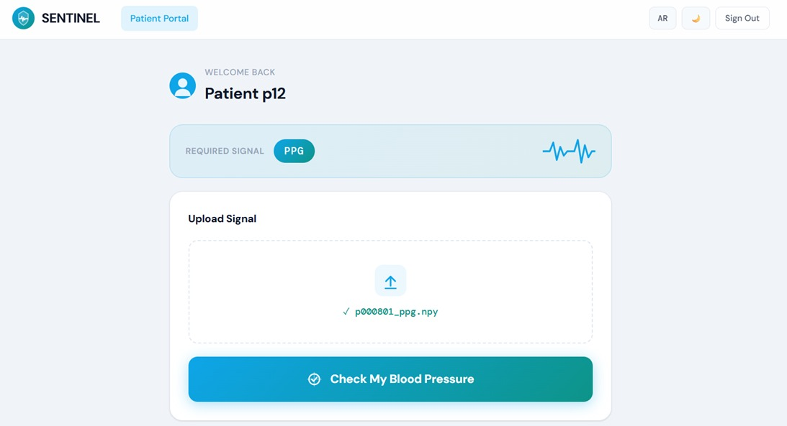
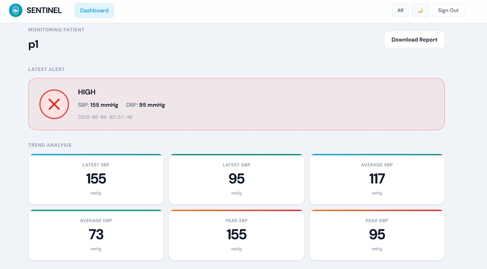
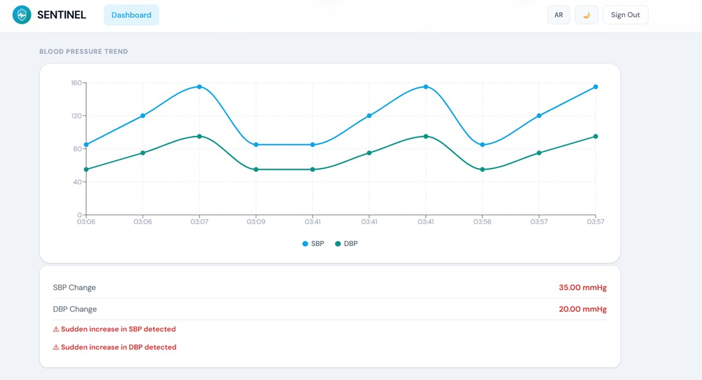

# 🛡️ SENTINEL
## Smart Elderly Navigation & Telehealth Integrated Lifeline


An AI-powered IoT healthcare system that continuously monitors elderly individuals through wearable sensors, analyzes vital signs using deep learning models, and provides real-time monitoring and emergency alerts to caregivers.

---

# 📖 Project Overview

SENTINEL (Smart Elderly Navigation & Telehealth Integrated Lifeline) is an intelligent healthcare platform developed as a Graduation Project.

The system integrates IoT devices, Artificial Intelligence, and Web Technologies to monitor elderly patients in real time. It analyzes physiological signals, detects abnormal conditions, and assists caregivers by providing instant alerts and continuous health monitoring.

---

# ✨ Key Features

- ❤️ Real-time Heart Rate Monitoring
- 🫁 Respiratory Signal Analysis
- 📊 Vital Signs Visualization
- 🤖 AI-Based Health Status Prediction
- 🚨 Emergency Alert System
- 🌐 Real-Time Healthcare Dashboard
- 👨‍⚕️ Patient & Caregiver Management
- 🔐 Secure Authentication
- 📡 IoT-Based Data Collection
- 📈 Intelligent Health Monitoring

---

# 🧠 AI Models

The project includes multiple Deep Learning models for analyzing physiological signals.

### 🔹 Single-Modality Models
- ECG + LSTM
- PPG + CNN
- Respiratory Signal + LSTM

### 🔹 Dual-Modality Model
- Combined physiological signal analysis

### 🔹 Tri-Modality Model
- Final multimodal deep learning model
- Highest prediction performance

---

# 💻 System Implementation

The platform consists of:

- 🌍 Frontend (React + Vite)
- 🐍 Backend (Python)
- 🗄️ SQLite Database
- 🤖 AI Integration
- 📡 IoT Communication
- 📈 Real-Time Dashboard

---

# 🛠️ Technologies Used

## 💻 Programming Languages

- Python
- JavaScript
- HTML5
- CSS3

## ⚛️ Frontend

- React
- Vite

## ⚙️ Backend

- Python

## 🤖 AI & Machine Learning

- TensorFlow
- Keras
- CNN
- LSTM

## 🗄️ Database

- SQLite

## 🌐 IoT

- ESP32
- Biomedical Sensors

---

# 🏗️ Repository Structure

```text
SENTINEL-Smart-Elderly-Monitoring-System
│
├── AI_Model_Experiments
├── Documentation
├── Demo
├── Images
├── System_Implementation
├── LICENSE
└── README.md
```

---

# 🖼️ System Architecture

<p align="center">
  
</p>

---

# 📸 Application Screenshots

### 🔐 Patient Sign In


---

### 📝 Patient Sign Up


---

### 👨‍👩‍👧 Relative Registration


---

### 📤 Patient Uploads



---

### 📈 Prediction Results



<br>



---

# 🎥 Project Demo

The complete demonstration video is available in:

```
Demo/Demo.mp4
```

---

# 📚 Documentation

The repository includes:

- 📄 Graduation Thesis
- 📊 Presentation
- 🇬🇧 English Abstract
- 🇪🇬 Arabic Abstract

---

# 🚀 Getting Started

### Clone the repository

```bash
git clone https://github.com/Mennahosam2/SENTINEL-Smart-Elderly-Monitoring-System.git
```

### Navigate to the project

```bash
cd SENTINEL-Smart-Elderly-Monitoring-System
```

### Install dependencies

```bash
cd System_Implementation
npm install
```

### Run the Frontend

```bash
npm run dev
```

### Run the Backend

```bash
python Backend/main.py
```

---

# 🎯 Project Objectives

- Improve elderly healthcare through continuous monitoring.
- Detect abnormal health conditions using AI.
- Reduce emergency response time.
- Support caregivers with real-time notifications.
- Enhance independent living for elderly individuals.

---

# 👩‍💻 Development Team

Graduation Project

Faculty of Computers and Artificial Intelligence

---

# 📄 License

This project is licensed under the **MIT License**.

See the **LICENSE** file for more details.

---

# ⭐ Support

If you found this project useful, please consider giving it a ⭐ on GitHub!

Thank you for visiting the repository ❤️
